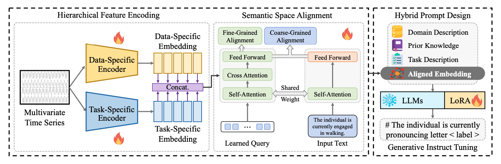
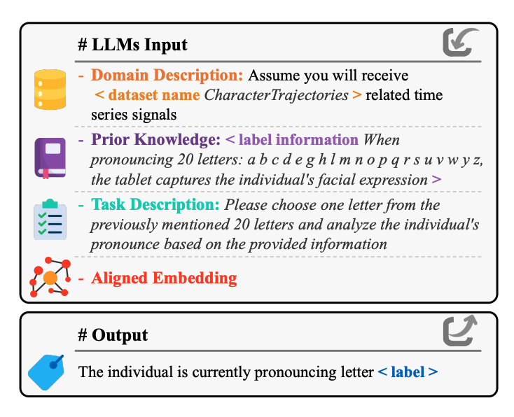

<div align="center">
  <h1>
        🎯 Hierarchical Multimodal LLMs with Semantic Space Alignment
for Enhanced Time Series Classification
  </h1> 
</div>

<div align="center">
  <a href="https://arxiv.org/pdf/2410.18686">
    📖 <strong>Paper</strong>
  </a> |
  <a href="https://drive.google.com/drive/folders/19P---oV4nQ53JgKnE0VX3t_N1jLliVSv?usp=drive_link">
    📊 <strong>Datasets</strong>
  </a> 
  <br><br>
</div>

---

## 📖 Abstract
**HiTime** is a hierarchical multimodal time series classification framework that integrates **hierarchical feature encoding with LLM-driven semantic reasoning**. This design unifies **dynamic temporal representation learning and dual-view semantic alignment**, enabling LLMs to capture both global temporal dependencies and localized discriminative patterns, and consistently achieving state-of-the-art performance across multivariate time series classification benchmarks.

This repository contains the official code for our [paper](https://arxiv.org/abs/2410.05711):
> Hierarchical Multimodal LLMs with Semantic Space Alignment
for Enhanced Time Series Classification 
> Xiaoyu Tao, Tingyue Pan, Mingyue Cheng$^*$, Yucong Luo

<details>
<summary><b>Full Abstract</b></summary>

Self-supervised learning has garnered increasing attention in time series analysis for benefiting various downstream tasks and reducing reliance on labeled data. Despite its effectiveness, existing methods **often struggle to comprehensively capture both long-term dynamic evolution and subtle local patterns in a unified manner**. In this work, we propose **TimeDART**, a novel self-supervised time series pre-training framework that **unifies two powerful generative paradigms to learn more transferable representations**. Specifically, we first employ a **causal Transformer encoder**, accompanied by a patch-based embedding strategy, to model the **evolving trends from left to right**. Building on this global modeling, we further introduce a **denoising diffusion process** to capture fine-grained local patterns through forward diffusion and reverse denoising. Finally, we optimize the model in an **autoregressive manner**. As a result, TimeDART effectively accounts for both global and local sequence features in a coherent way. We conduct extensive experiments on public datasets for time series forecasting and classification. The experimental results demonstrate that **TimeDART consistently outperforms previous compared methods**, validating the effectiveness of our approach.

</details>

## 🎁 Updates/News:

🚩 **News** (Oct. 2024): HiTime initialized.


## 🌟 Overview

<div align="center">

<p><em>Figure 1: Overview of the HiTime.</em></p>
</div>

<div align="center">

<p><em>Figure 1: Overview of the HiTime.</em></p>
</div>

**HiTime** is a hierarchical multimodal framework for multivariate time series classification that processes data through three main modules：

It begins with a **Hierarchical Temporal Feature Encoder**, where multivariate time series are transformed into multi-level representations through stacked **data-specific and task-specific** embeddings, capturing both coarse-grained and fine-grained temporal patterns.

A **Dual-View Semantic Alignment Module** then aligns the hierarchical temporal representations with textual semantics, using contrastive learning to bridge the distribution gap between time series and language.

This is followed by a **Hybrid Prompting and LLM Adaptation Stage**, where tailored prompts and parameter-efficient tuning enable the pre-trained LLM to interpret temporal features and generate discriminative textual outputs for classification.

The overall training objective leverages contrastive alignment and lightweight LLM adaptation to effectively integrate hierarchical temporal information into language models, resulting in more transferable representations and superior performance on multivariate time series classification tasks.


## ⚙️ Key Features

- **Motivation (Temporal Modeling Gap)**: LLM-based time series classification methods often fail to capture dynamic temporal variations and overlook hierarchical temporal dependencies inherent in multivariate time series.
- **Motivation (Semantic Misalignment)**: Temporal features and textual semantics typically lie in mismatched representation spaces, making it difficult for LLMs to interpret continuous temporal patterns.
- **Hierarchical Multimodal Framework**: HiTime employs a hierarchical temporal encoder to extract multi-level representations and a dual-view contrastive alignment module to bridge the semantic gap between time series and text.
- **Hybrid Prompting for LLM Adaptation**: Uses parameter-efficient hybrid prompting to adapt pre-trained LLMs for time-series-aware reasoning and robust text-based classification without full fine-tuning.
- **Empirical Superiority**: Consistently surpasses strong baselines across multivariate time series classification benchmarks, demonstrating the benefits of hierarchical temporal integration and semantic alignment.


## 🚀 Quick Start

### 1. Environment

We recommend using **Python 3.9+** and setting up a clean environment via `conda`:

```bash
conda create -n hitime python==3.10
conda activate hitime

cd <YOUR WORKING DIR>
git clone git@github.com:Xiaoyu-Tao/HiTime.git

```

### 2. Datasets and Models

First, the training and evaluation datasets used in our experiments can be found in [Google Drive](https://drive.google.com/drive/folders/19P---oV4nQ53JgKnE0VX3t_N1jLliVSv?usp=drive_link). Then, create a directory named `datasets` and then download the necessary datasets into it.

```bash
mkdir datasets
```

### 3. Training and Evaluation


HiTime: We provide default hyper-parameter settings and scripts for each training stage in `stage0_tsEncoder`, `stage1_align`, and `stage2_LLM`. You can reproduce the full pipeline on a dataset with:
```bash
sh scripts/
```

## 💪 Performance

### 🗂️ Main Result


### 📈 Ablation Study

<div style="display: flex; justify-content: space-between; align-items: flex-end;">

  <div style="width:48%; text-align:center;">
    
    <p><b>(a) Representation-level Ablation</b></p>
  </div>

  <div style="width:48%; text-align:center;">
    
    <p><b>(b) Prompting Strategy Ablation</b></p>
  </div>

</div>


## 🙏 Acknowledgement

This repo is built on the pioneer works. We appreciate the following GitHub repos a lot for their valuable code base or datasets:

- [CrossTimeNet](https://github.com/Mingyue-Cheng/CrossTimeNet)

- [Convtimenet](https://github.com/Mingyue-Cheng/ConvTimeNet)

- [BLIP-2](https://github.com/salesforce/LAVIS/tree/main/projects/blip2)
  

### Further Reading
This paper is part of our ongoing exploration of time series analysis.  Our upcoming works expand this direction toward:


- [**From Values to Tokens: An LLM-Driven Framework for Context-aware Time Series Forecasting via Symbolic Discretization**](https://arxiv.org/pdf/2508.09191): symbolic discretization for temporal modeling.
  
## 🔖 Citation

>🙋 Please let us know if you find out a mistake or have any suggestions!
>
>🌟 If you find our work helpful, please consider to star this repository and cite our research.

```bibtex
@article{tao2024hierarchical,
  title={Hierarchical multimodal llms with semantic space alignment for enhanced time series classification},
  author={Tao, Xiaoyu and Pan, Tingyue and Cheng, Mingyue and Luo, Yucong},
  journal={arXiv preprint arXiv:2410.18686},
  year={2024}
}
```
